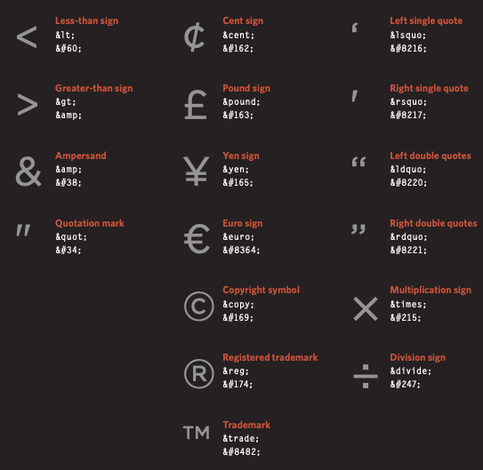

# HTML

## Duckett: HTML & CSS, Chapter 18 - Process & Design

### Design Considerations

- Who is your target audience?
- Why are people coming to your website? What are their motivations and goals?
- What information do they need to achieve their goals quickly and effectively?
- How often will people visit your site? How often does it need to be updated?
- Visual Hierarchy: Use size, color, style and images to direct users to the information they want. Know that users skim for the information they need.
- Group similar elements.
- Use consistent styling throughout the webpage.

**Site Map** - A diagram of the website's structure.  
**Card Sorting** - technique of using paper squares to design your site map, and determine what goes on each page.  
**Wireframe** - Sketch of the information that will go on each page of your website. Does not include style choices. Online wireframing tools include: [http://gomockingbird.com](http://gomockingbird.com) and [http://lovelycharts.com](http://lovelycharts.com).  

## Duckett: HTML & CSS, Chapter 17 - HTML5 Layout

- HTML 5 added many semantic tags to differentiate elements, instead of using a bunch of div tags.
  - header, footer, nav, article, aside, section, hgroup (heading groups), figure, figcaption
- using `<a>` tag around other blocks to link.
- older browsers may not recognize new semantic tags, use this css to treat them as inline elements: `header, section, footer, aside, nav, article, figure {display: block;}`

## Duckett: HTML & CSS, Chapter 8 - Extra Markup

- Begin each page with a doctype `<!DOCTYPE html>`
- Commenting in HTML `<!-- -->`
- id & class attributes
- block (`
` and others) vs inline elements ``
- `<iframe>` display another website inside your site
- `<meta>` information about your website nested in your head tag
- **Escape Characters**: characters that have a special meaning in html can be referenced in other ways using.

  
(From DUCKETT  HTML and CSS Design and Build Websites, p.194)

## Lecture Notes

- Create a placeholder image for your website. ``
- Lorem ipsum generators through google for text placeholders.

## Extra: var vs let

[let vs. var tutorial](https://www.javascripttutorial.net/es6/difference-between-var-and-let/)

- `var`
  - used to declare global variables
  - var allows you to redeclare variables, `let` does not
- `let` variables are not added to the global namespace

[<==Back](../README.md)
