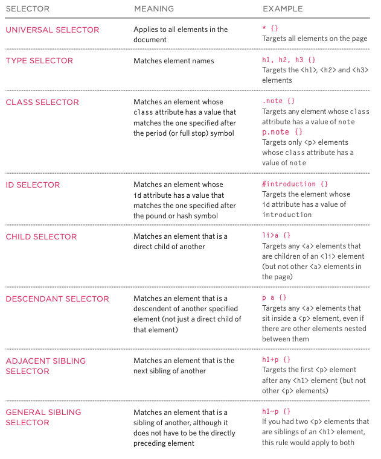

# Class05 - CSS

## Duckett: HTML & CSS, Chapter 10: Introducing CSS

- Block & Inline Elements
  - Block elements start on a new line, inline elements flow within the text.

  
(p.238)

## Duckett: HTML & CSS, Chapter 11: Color

- CSS Properties Covered: color, background-color
- RGB, HEX, Color Name, HSL/HSLA (Hue, Saturation, Lightness, Alpha)

[<==Back](../README.md)