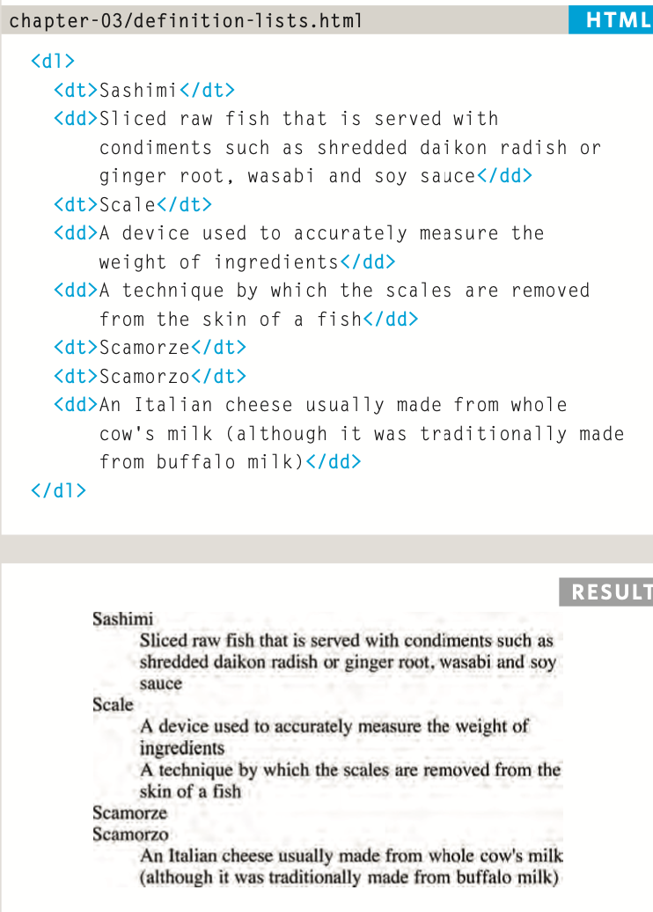
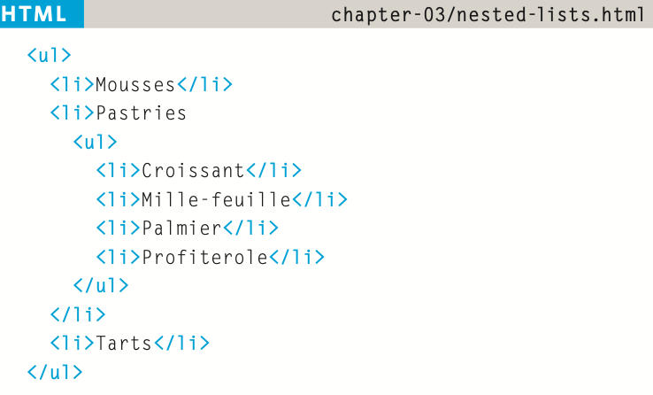
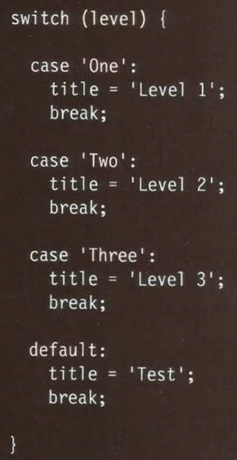

# Class 3

## Read03: HTML Lists, Control Flow with JS, and the CSS Box Model

### Duckett HTML Chapter 3: “Lists” (pp.62-73)

- `<ol>` ordered list, 1 2 3 4 5
- `<ul>` unordered list, bullet points
- `<li>` list item used for ol and ul tags
- definition lists: used for writing word definitions

- nested list structure

### Duckett HTML Chapter 13: “Boxes” (pp.300-329)

- css width and height
- limiting width and height with min-height min-width max-height and max-width
- overflow: hidden or scroll. manages what to do with text that does not fit in the box size
- Boxes have 3 properties:
  - padding: space between border and content within it
  - border
  - margin: space between border of this box and another.
- border-width border-style border-color
  - `border:` followed by the values for these in this order
- margin/padding shorthand order: top right bottom left
- **centering a box:**
  - set width. then set margin left and right to auto.
- display: inline block inline-block none, and many more
- visibility: hidden, visible
- more box styling: border-image, box-shadow, border-radius

### Duckett JS Review from Reading 02 - Chapter 2: “Basic JavaScript Instructions” (pp.70-73)

- Creating and indexing arrays
- `let myArray = new Array();`
- `let myArray = ['someinfo'];`
- `myArray[0]`

### Duckett JS Chapter 4: “Decisions and Loops” from switch statements on (pp.162-182)

- Switch statments to handle multiple cases
  - include a default

- weak typing: a variable can change datatype when not using strictly equals.
- NaN's, empty values and unassigned variables count for falsy values in js.
- can use a unary operator to check truthyness, for example:
  - `if (document.getElementById('header')){}`
- examples of for loops and while loops in javascript shown
  - break and continue keywords used in js

[<== Back](/README.md)
