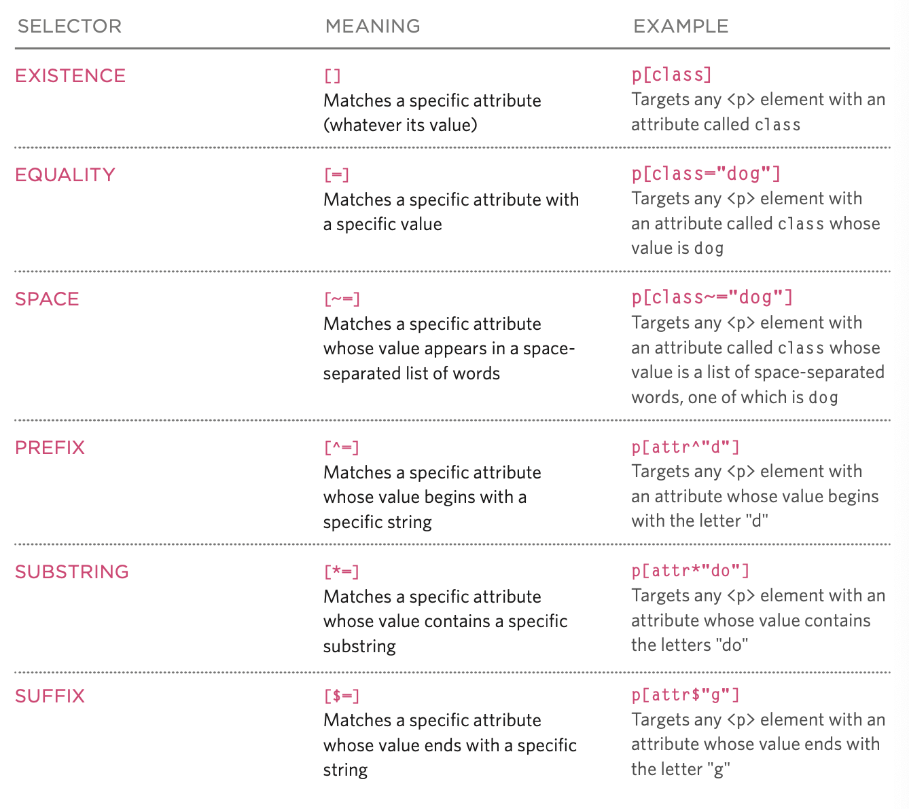

# Class 5

## Read05: Images, Color, Text

### Duckett HTML Chapter 5: “Images” (pp.94-125)

- use css to align images, not html
- optimize: save in common format, save image at same size as you want it displayed, higher resolution images take longer to load.
- nesting an image tag in a figure tag, so you can use figcaption tag to contain a caption for the image.
- rest of chapter discussed general information about images I already know.

### Duckett HTML Chapter 11: “Color” (pp.246-263)

- See [notes from CodeFellows 102](../code102/class05-css.md)

### Duckett HTML Chapter 12: “Text” (pp.264-299)

- Typeface types: serif, sans-serif, monospace
- Text style considerations: weight, style, stretch
- Using font-family: will group fonts by type and the one that is supported by the browser will be shown
- font-size property: use pixels, ems, or...
  - percentages are based on the default browser size of 16px, so 200% would be 32 px.
- @font-face
  - let the user see a font, even if it is not installed on their computer, by linking them to a site where it will be installed.
  - beware, the format these fonts are saved in will not necessarily work on all browser. see browser compatibility on p.278
- font-weight: bold or normal
- font-style: normal italic or oblique
- text-transform: uppercase lowercase capitalize
- text-decoration: none underline overline line-through blink
- line-height, letter-spacing, word-spacing
- text-alight: right left center justify
- vertical-align, used to align inline elements, not intended for block level elements but does work on table cells
- text-indent, text-shadow, :first-letter, :first-line
- responding to users actions, a:link :visited :hover :active :focus
- attribute selectors: see [CSS Diner](https://flukeout.github.io/) for practice

[<== Back](../README.md)
