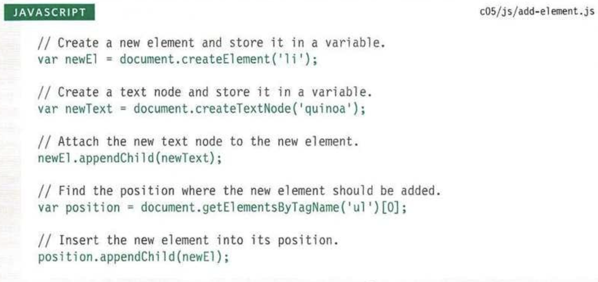

# Class 6

## Problem Domain, Objects, and the DOM

### Article: Understanding the problem domain is the hardest part of programming

[Article](https://simpleprogrammer.com/understanding-the-problem-domain-is-the-hardest-part-of-programming)

- When you don't have a clear understanding of what the problem is that you're trying to solve, it is exceptionally hard to solve it.
- This can be allievated by spending more time at the beginning learning about the problem domain, what exactly is the problem?
- Alternatively, you can brake the problem down into smaller chunks.
- If you don't understand what it is you're trying to solve for, spend more time figuring that out before diving into code. It will save you time down the road.

### Duckett JS Chapter 3: “Object Literals” (pp.100-105)

- Objects in JS are created much like a dictionary in Python, with key:value pairs, although here in JS you can also house functions within it.
- An object literal is when you create one instance of an object, instead of using a constructor that will be used for multiple objects.
  - This can be accomplished by declaring a variable and using key:value pairs in 'curly' braces.
  - Keys are not placed within quotes
  - You can use square brackets or dot notation to access values or call functions on an object.

### Duckett JS Chapter 5: “Document Object Model” (pp.183-242)

- The DOM tree is comprised of Nodes, commonly referred to as elements represented by tags.
- Steps to working with the dom:
  - Locate the node that represents the element that you want to work with.
  - Work with those elements by accessing or updating the text or attribute values.
- Four types of nodes:
  - document node
  - element node
  - attribute node
  - text node
- Cache DOM queries by storing them in a variable
- Get a single node with getElementByID('id') or querySelector('css selector)
- Get a **node list** with getElementsByClassName('class) getElementsByTagName('tagname') and querySelectorAll('css selector)
  - this will return a list of elements that can be accessed by index within the returned list. Use .item(index#) method or square brackets (this method preferred for speed).
  - you can loop through a node list like any other list
- Traversing the DOM with parentNode previousSibling nextSibling firstChild lastChild
- Beware of the potential for Whitespace nodes that occur in most browsers, come from spaces and carriage returns in the code.
- setting content with innerHTML
- Adding an element to the DOM tree:

- Remove an element with removeChild() method
- Don't use innerHTML to add content from a user. Instead use DOM manipulation (using methods)
- XSS (Cross Site Scripting) attacks. User adding a script into the webpage
  - Validate input from users, double check validation before putting into database. Do not allow users to input html markup or JavaScript.
  - **use textContent or innerText, not innerHTML**
  - in jQuery, use .text(), not .html()
- setAttribute and removeAttribute methods

## Lecture Notes

- Signature of a function: What is the input and what is the output.
- imgElem.setAttribute('src', 'images/kittenName.jpg')
- Creating a new element with JS
  - let bioElem = document.createElement('p');
  - articleElem.appendChild(bioElem);
  - bioElem.textContent = frankie.bio;

[<== Back](../README.md)
