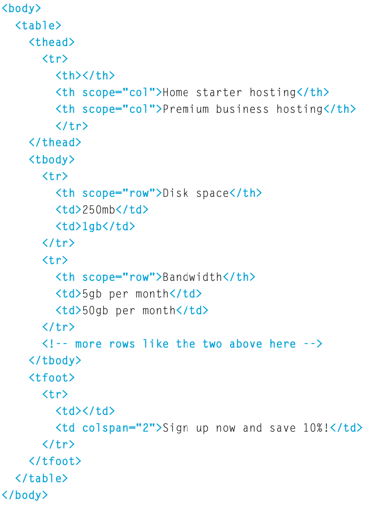

# Class 7

## Object-Oriented Programming, HTML Tables

### Domain Modeling

[Article on Domain Modeling](https://github.com/codefellows/domain_modeling#domain-modeling) discusses:

- Domain modeling is the process of creating a conceptual model for a specific problem. And a domain model that's articulated well can verify and validate your understanding of that problem.
- Using a constructor to create object instances
- Generating a random number in JS
- Use small methods that focus on doing one job well.

### Duckett HTML Chapter 6: “Tables” (pp.126-145)

- `<table> <tr>row <td>data <th>head`
- colspan and rowspan as attributes to have data span multiple spaces
- `<thead> <tbody> <tfoot>` distinguish the content of the table
- 'old'/depreciated attributes: width, border, spacing and background

### Duckett JS Chapter 3: “Functions, Methods, and Objects” (pp.106-144)

- Creating a constructor using `function Hotel(name, rooms){this.name = name; this.rooms = rooms;}`
- add a new property by assigning it to the object outside of the constructor: `hotel.gym = true;`
- delete with `delete hotel.gym`
- using `this.`
- browser objcts: window & document
- p.128-135 built in functions for working with strings and math/numbers
- p.136-139 Working with Date objects

## Lecture Notes

- contructor functions start with a capital letter, pascal case
- use prototype to add a function to a class(an object defined with a constructor)

[<== Back](../README.md)
