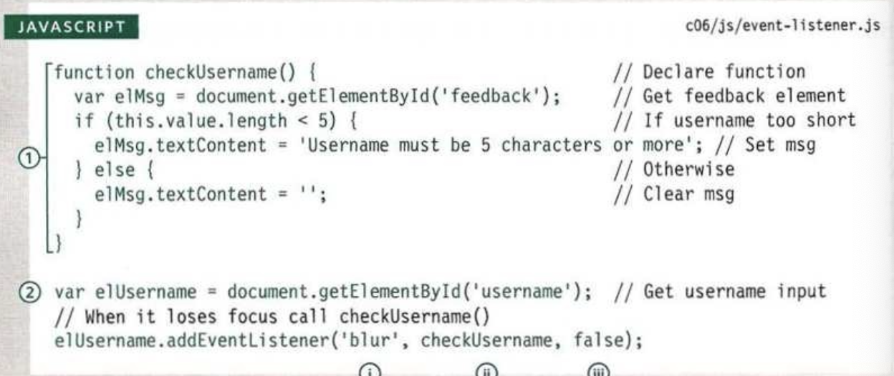

# Class 9

## Read09: Forms & Events

### Duckett HTML Chapter 7: “Forms” (p.144-175)

- use name attribute to identify the input for the backend to select
- p.152-162 shows different form inputs
- use label tag to give more information to an input
- fieldset and legend tag to group form elements
- form validation with 'required' attribute
- type attribute= email, url, date, search
- placeholder attribute

### Duckett HTML Chapter 14: “Lists, Tables & Forms” (pp.330-357)

- list-style-type to remove bullets or change what marker is shown. there are more list style properties like using images or changing position
- border-spacing and border-collapse: remove space between table cells
- chapter discusses approaches for styling different form elements
- cursor: change what the pointer looks like on screen

### Duckett JS Chapter 6: “Events” (pp.243-292)

- Events fire (clicked on by user) or are raised. Events are said to trigger a function or script.
- Many types of events: UI (interaction with browser), Keyboard, Mouse, Focus, Form, DOM Mutation
- In JS: Select Element, Specify Event, Call Code
- Do not use HTML Event Handlers
- DOM event handlers and event listeners
- Traditional DOM Event Handlers: element.onevent = functionName; Only one function can be attached to each event handler
- Event listeners are not supported by old browsers. They can deal with more than one function at a time.
  - element.addEventListener('event', functionName, false);

- Can use an anonymous function in an event handler. Can use this to pass in arguments into a function you're calling.
- If you hover or click on a link, you will also be hovering or clicking on its parent elements
- Events are objects and you can use them to get useful information, like the target and type of the event.
- Creating lots of event listeners can slow down a page. Event flow allows you to listen for an event on a parent element.
- Event object builtin methods: preventDefault(), stopPropagation()
- Event delegation: seems advanced, seems to have a lot to do with certain things being supported in a browser.
- p.273-291 show examples for different kinds of events.

[<== Back](../README.md)
