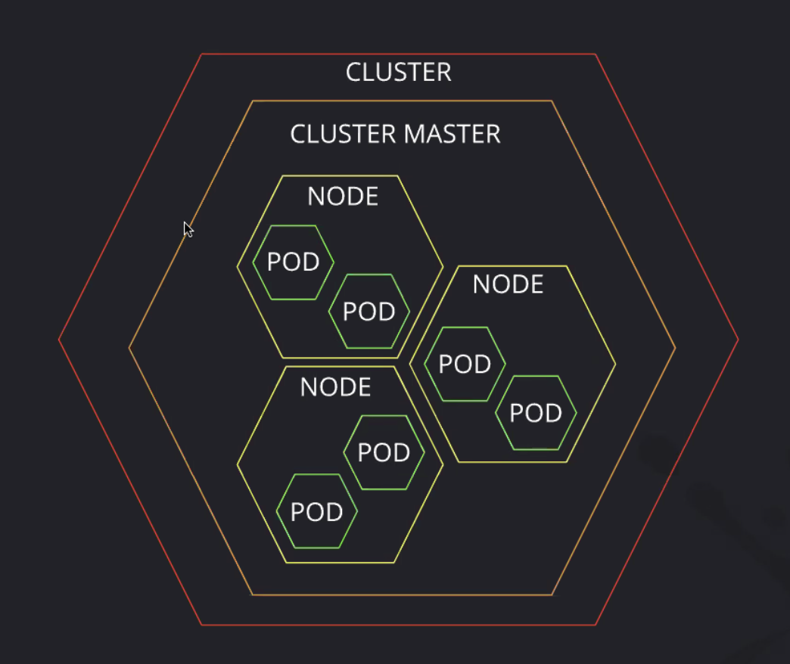

# Partner Power Hour - Kubernetes

## Kat Cosgrove - Developer Advocate JFrog

She uses twitter primarily and reps it highly for tech. Doesn't use LinkedIn, but send a message if you do try to connect.

[GitHub lecture repo](https://github.com/katcosgrove/kubernetes-intro)

Container - executable package of software, solves the problem of it only working on my machine.
Not a VM. VMs are large, containers only emulate the os and needed dependences
Kubernetes: a Container Orchestration tool. manages the containers. Can do this without kubernetes but it is very difficult. 
Docker ‘Images’/Containers will be managed in Kubernetes
Hardware Layer: Node is a small vm, clusters are a collection of nodes
Software Layer: Containers, then a collection of containers is a POD

minikube - not used in production
kubectl - cli to control kubernetes

Kubernetes is useful because it allows you to scale without a whole lot of work.
ingress means to allow something in. see ingress.yaml file

[<== Back](../README.md)
