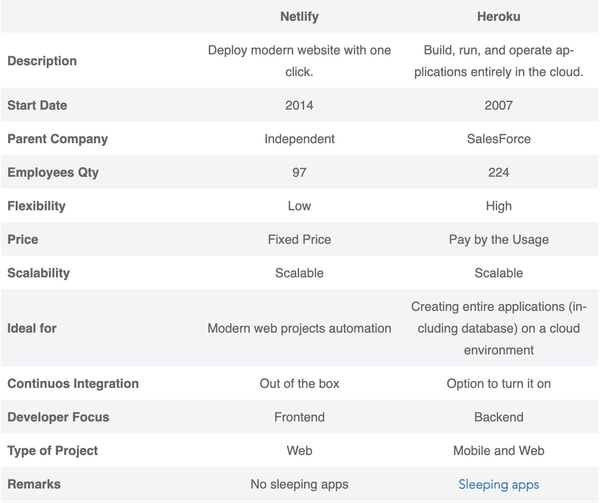

# Class 2 - State and Props

## [State and Lifecycle](https://reactjs.org/docs/state-and-lifecycle.html)

- State is stored in the constructor as an object with key value pairs
- Refer to it with this.state.key
- Using componentDidMount and componentWillUnmount to manage lifecycle. In the example shown, these methods were called with a function called tick to increment a timer every second.
- To re-assign a value to state, must use setState method.
- If you need to re-assign a state value which is dependent on doing some business logic on state and props, pass in both into the setState method like so

```javascript
this.setState((state, props) => ({
  counter: state.counter + props.increment
}));
```

- State is local to the component. It is not accessed by parent component. Child components can access them only if they are passed down, but the child wouldn't know if the value came from it's parents props or state.

## [Handling Events](https://reactjs.org/docs/handling-events.html)

- React events are named using camelCasing. For example onclick is now onClick.
- Must call preventDefault method if you want to prevent default behavior, like a button reloading the page on click.
- To use event listeners, create a listener function, and define it in the constructor as well to bind it.
- To pass a parameter into an event handler you can use either of these formats:

```javascript
<button onClick={(e) => this.deleteRow(id, e)}>Delete Row</button>
<button onClick={this.deleteRow.bind(this, id)}>Delete Row</button>
```

## [Conditional Rendering](ttps://reactjs.org/docs/conditional-rendering.html)

- Conditionals can be used in jsx the same way they are used in js.
- A potentially shorter way to do this is to use curly braces. `{something && html expression}`. If the something evaluates to true, then the html expression will be rendered.
- Using conditional operator for inline conditionals.
  - `condition ? true : false`
  - `The user is <b>{isLoggedIn ? 'currently' : 'not'}</b> logged in.`
  - This is best for oneliners, any more it gets more confusing to read.
- If you don't want something to render, return null.

## [React Tutorial through Dev Tools](https://reactjs.org/tutorial/tutorial.html)

See notes taken for this section in [class 1 notes](class-01.md)

## [Bootstrap with React](https://react-bootstrap.github.io/)

- React-Bootsrap replaces Bootstrap, focusing styling around React components.
- So start trying to use this when you're working with React

## [Netlify](https://www.netlify.com/)

- Netlify works with your git workflow.
- This is a platform to build, deploy and collaborate on web apps.
- A place for deploying scalable applications, includes CI/CD workflow.
- Focused more on front end development.
- On some level a competitor to Heroku, here is a comparison from [Back4App](https://blog.back4app.com/netlify-vs-heroku/)



## In-Class Notes

### Map

- Map loops through an array, and what you return will add a modified item to a new array.
- If you do a map on one-line, it is implicitly returned.
- You can pass in value, index and array into map, just like with forEach.

### More

- To specify class to an html tag in jsx, you need to use className instead of class.
- Props are properties that you send in to a child component when you call the component. For example `<HornedBeast title='narwhal' />`. title is a prop here.
- Don't need to use .js extensions on imports.
- Props is passed down behind the scenes if you don't create a constructor. If you do create a constructor, you need to pass in props and call super(props).
- If you're using an image on your page that is in your project directory, you need to import the image. Using a relative path in src will not work.
- When you use an arrow function in React, you do not need to explicitly bind it to the class.
- Arrow functions will allow `this` to escape. Meaning it refers to the context in which the arrow function is in. This means that in React we don't need to use bind, but also means that we need to be careful about the scope that the arrow function is in. Using it to define a prototype function causes problems.
- We can also using binding for `this`, like here: `this.handleClick = this.handleClick.bind(this);`
- [https://emojifinder.com](https://emojifinder.com)
- [http://caniemoji.com/](http://caniemoji.com/)

[<== Back](../README.md)
