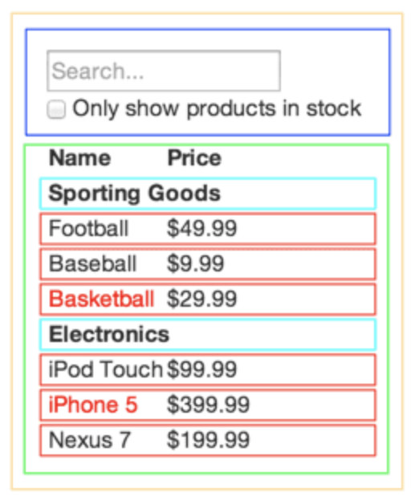

# Class 5

## [Thinking In React](https://reactjs.org/docs/thinking-in-react.html)

- Step 1: Break the UI into components. Draw component boxes around your mock.

- Step 2: Build a static version in React
  - Don't use state at all. These components will only have render methods.
- Step 3 & 4: Figure out how you want to use state & where you want it to live. 
  - Implement it: pass state and props in a downward dataflow so child components have what they need.
- Step 5: Add inverse data flow.
  - Make it so child components can update state if necessary so that changes are happening reactively as you make them.