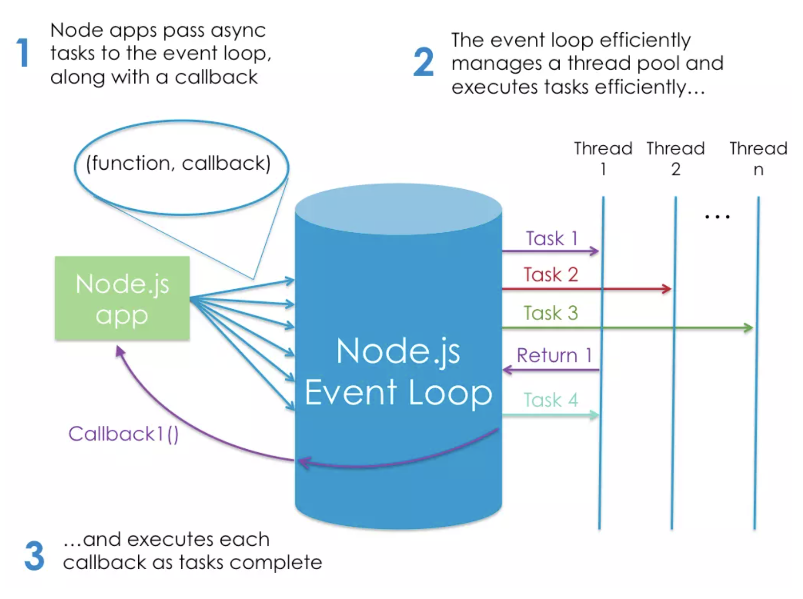

# Node.js

## [Intro To Node.js](https://www.sitepoint.com/an-introduction-to-node-js/)

- Standard Definition: Node.js is an event-based, non-blocking, asynchronous I/O runtime that uses Google’s V8 JavaScript engine and libuv library.
- Node Is Built on Google Chrome’s V8 JavaScript Engine, but that doesn't mean that you're running it on a browser.
- Install Node using package managers like nvm
- To run a file in node, just type `node <filename>` in your terminal
- With Node, you can use the latest javascript features including, template literals, object destructuring and Array.prototype.flatMap()
- Node comes with a bundled package manager called npm.
  - npm is also the world’s largest software registry. There are over 1,000,000 packages of JavaScript code available to download
- `npm install -g <packagetoinstall>`
  - -g is for global install
- package.json stores your dependencies
- Node has benefits for the backend in the way of async i/o
- The traditional approach to scaling a Node app is to clone it and have the cloned instances share the workload. Node.js even has a built-in module to help you implement a cloning strategy on a single server.



- Write a simple server:

```javascript
const http = require('http');

http.createServer((request, response) => {
  response.writeHead(200);
  response.end('Hello, World!');
}).listen(3000);

console.log('Server running on http://localhost:3000');
```

- Node is particularly suited to building applications that require some form of real-time interaction or collaboration.
- It’s also a good fit for building APIs where you’re handling lots of requests that are I/O driven
- You can use Express.js to minimize the boilerplate
- Node easily works with JSON, no conversion necessary, maily because 'JavaScript Object Notation'
- Main plus of using Node on the back end is not having to switch gears between a front end language and something else.
- Many other uses for node outside of web development.


## [6 Reasons for Pair Programming](https://www.codefellows.org/blog/6-reasons-for-pair-programming/)

1. Greater Efficiency: pair programing takes slightly longer, but produces higher-quality code
1. Engaged collaboration: both programmers are more focused than if they were working alone
1. Learning from fellow students: working with a teammate can expose developers to techniques they otherwise would not have thought of
1. Social skills: Pair programming is great for improving social skills because when working with someone who has a different coding style, communication is key.
1. Job Interview Readiness: Employeers will include pair programming in interviews.
1. Work environment readiness: CS grads don't necessarily have this experience; with this practice you're ready to hit the ground running.

## [Axios](https://www.npmjs.com/package/axios)

- Promise based HTTP client for the browser and node.js
- Make requests to api's with this tool
- ^ This is the link to the docs

## [MDN Async Await](https://developer.mozilla.org/en-US/docs/Learn/JavaScript/Asynchronous/Async_await)

- ^ This resource from MDN examples how to use async/await to write asyncronous code in JS.
- You can use await when calling any function that returns a Promise, including web API functions.
