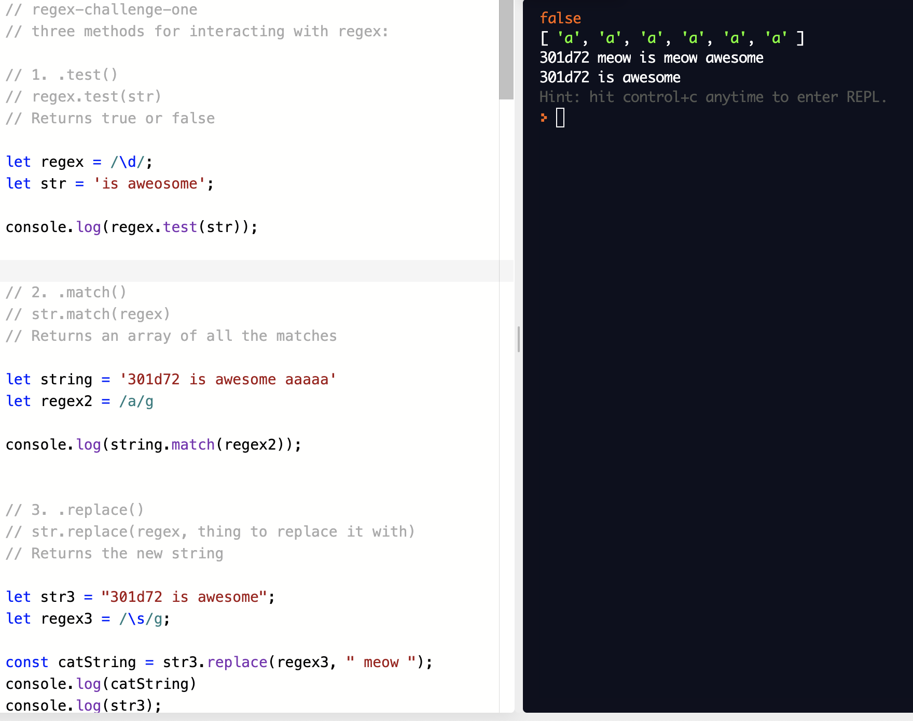

# Class 8 - SuperAgent and Regular Expressions

## [SuperAgent](https://visionmedia.github.io/superagent/)

- SuperAgent is light-weight progressive ajax API
- In more simple terms, SuperAgent is a way to make requests using JavaScript and this package.
- See these docs for more specific information on how to make different requests with SuperAgent.

## [Regexr](https://regexr.com/)

- This is a resource to experiment with Regular Expressions
- Take note of the cheatsheet to help with creating these regular expressions

## [Regex tutorial — A quick cheatsheet by examples](https://medium.com/factory-mind/regex-tutorial-a-simple-cheatsheet-by-examples-649dc1c3f285)

- Can't read this information without paying for it

## [Regex 101](https://regex101.com/)

- This is another resource to experiment with Regular Expressions
- Checkout the quick reference section at the bottom right to see some ways to make regular expressions.

## More on Regular Expressions

