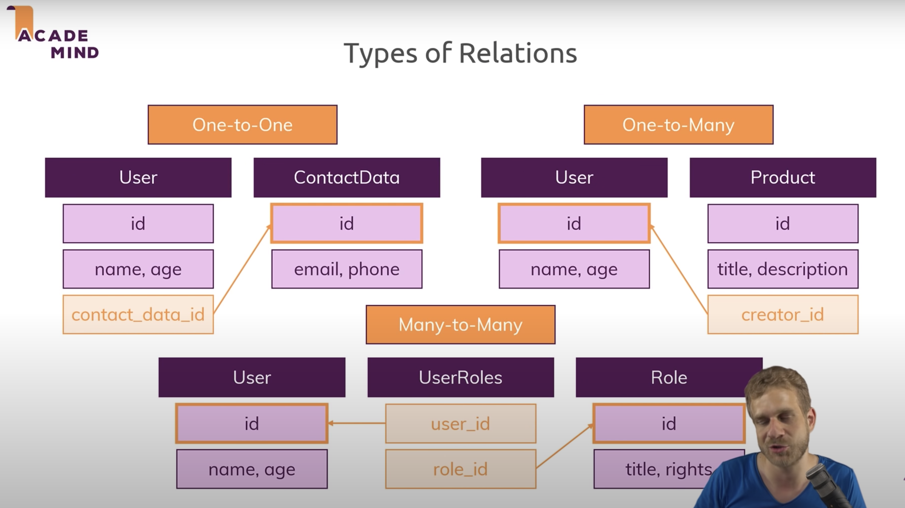

# Class 12: Mongo and Mongoose

## [SQL vs NoSQL Database Differences Explained with few Example DB](https://www.thegeekstuff.com/2014/01/sql-vs-nosql-db/?utm_source=tuicool)

- NoSQL databases are document based, key-value pairs, graph databases or wide-column stores. SQL databases represent data in form of tables.
- NoSQL databases have dynamic schema for unstructured data.
- SQL databases are scaled by increasing the horse-power of the hardware. NoSQL databases are scaled by increasing the databases servers in the pool of resources to reduce the load.
- SQL databases are good fit for the complex query intensive environment
- NoSQL database are highly preferred for large data sets
- Examples of DBs:
  - SQL Databases:
    - MySQL
    - MS SQL
    - Oracle
    - SQLite
    - PostgreSQL
  - NoSQL Databases:
    - MongoDB
    - CouchDB
    - Redis

## [NOSQL DATA MODELING TECHNIQUES](https://highlyscalable.wordpress.com/2012/03/01/nosql-data-modeling-techniques/)

- Relational modeling is typically driven by the question of "What answers do I have?". NoSQL typically by the question of "What questions do I have?"
- Types/Examples of NoSQL dbs
  - Key-Value Stores: Oracle Coherence, Redis, Kyoto Cabinet
  - BigTable-style Databases: Apache HBase, Apache Cassandra
  - Document Databases: MongoDB, CouchDB
  - Full Text Search Engines: Apache Lucene, Apache Solr
  - Graph Databases: neo4j, FlockDB

### Conceptual Techniques

  1. Denormalization
      - copying of the same data into multiple documents or tables in order to simplify/optimize query processing
  1. Aggregates
      - Soft schema allows one to form classes of entities with complex internal structures (**nested entities**)
  1. Application Side Joins (sometimes joins still need to happen)
      - joins are often handled at design time
      - query time joins have a performance penalty

### General Modeling Techniques

  1. Atomic Aggregates
  1. Enumerable Keys
  1. Dimensionality Reduction
  1. Index Table
  1. Composite Key Index
  1. Aggregation with Composite Keys
  1. Inverted Search - Direct Aggregation

### Hierarchy Modeling Techniques

  1. Tree Aggregataion
  1. Ajacency Lists
  1. Materialized Paths
  1. Nested Sets
  1. Nested Documents Flattening: Numbered Field Names
  1. Nested Documents Flattening: Proximity Queries
  1. Batch Graph Processing

## [Mongoose Docs](https://mongoosejs.com/docs/api.html#Model)

- Mongoose is "elegant mongodb object modeling for node.js"
- What it looks like:

```javascript
const mongoose = require('mongoose');
mongoose.connect('mongodb://localhost:27017/test', {useNewUrlParser: true, useUnifiedTopology: true});

const Cat = mongoose.model('Cat', { name: String });

const kitty = new Cat({ name: 'Zildjian' });
kitty.save().then(() => console.log('meow'));
```

- See the models section in the docs, linked above, for more information on what building a model can look like.

## Video: [SQL vs NoSQL or MySQL vs MongoDB](https://www.youtube.com/watch?v=ZS_kXvOeQ5Y&ab_channel=Academind)

- SQL
  - Structured Query Language
  - Uses table structure
    - Fields (Columns)
    - Records (Rows)
  - Have to normalize data coming in so it fits within the schema of the defined db schema
  - One-to-One, One-to-Many, Many-to-Many
  - Horizontal scaling is very hard/almostimpossible and vertical scaling has limits (it's a big limit though). SQL normally is vertically scaled.
    - Vertical scaling is adding more computing power.
    - Horizontal scaling is having a distributed database.

  

- MongoDB
  - Database
    - Collections (like tables)
    - Documents (like a row)
  - No schema, super flexible
  - Don't rely on relations. Don't need to make complex queries because everything you need should be in one place, the document you're working with. IRL some relations may be made.
  - Can be scaled vertically and horizontally.
