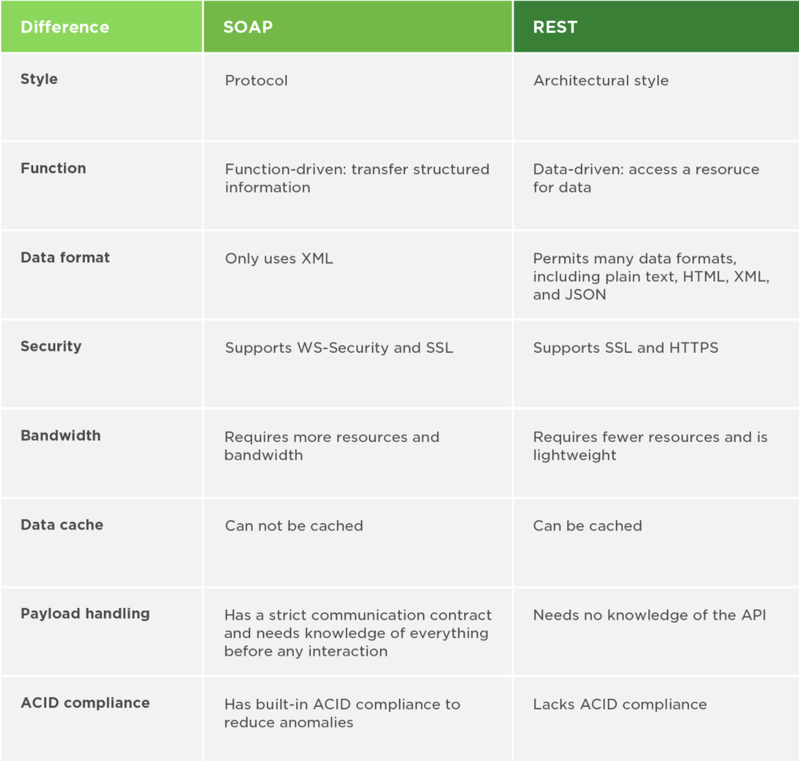

# Readings: Express

## Review, Research, and Discussion

1. What’s the difference between PUT and PATCH?
    - Both are used for updating. With a PUT request, you provide the entire object to be replaced. With a PATCH request, you only provide the one key/value pair that will be replaced. Research done on [StackOverflow](https://stackoverflow.com/questions/28459418/use-of-put-vs-patch-methods-in-rest-api-real-life-scenarios).
1. Provide links to 3 services or tools that allow you to “mock” an API for development like json-server
    - [Mirage](https://miragejs.com/)
    - [MSW](https://github.com/mswjs/msw)
    - [FakeRest](https://github.com/marmelab/FakeRest)
1. Compare and contrast Swagger and APIDoc.js 1 Which HTTP status codes should be sent with each type of (un)successful API call?
    - Common http status codes include:
        - 404 - Not found
        - 403 - Forbidden
        - 500 - Server Error
        - Many more can be seen in the [mdn docs](https://developer.mozilla.org/en-US/docs/Web/HTTP/Status)
1. Compare and contrast SOAP and ReST
    - Here's a great comparison chart from [Upwork](https://www.upwork.com/resources/soap-vs-rest-a-look-at-two-different-api-styles?utm_source=google&utm_medium=cpc&utm_campaign=348930905&utm_content=111050689163&utm_term=&vt_cmp=348930905&vt_adg=111050689163&vt_src=google&vt_kw=&vt_device=c&utm_source=google&utm_campaign=348930905&utm_medium=paidsearch&gclid=Cj0KCQjw1PSDBhDbARIsAPeTqrew_3JeThUFjiwgLw_LoZyqMrZLCf2i3UtGHoryeEiYDlGGdTWFjbIaAu-PEALw_wcB)

## Document the following Vocabulary Terms

- **Web Server** - "computer software and underlying hardware that accepts requests via HTTP, the network protocol created to distribute web pages,[1] or its secure variant HTTPS" - [wikipedia](https://en.wikipedia.org/wiki/Web_server)
- **Express** - "Express.js, or simply Express, is a back end web application framework for Node.js, released as free and open-source software under the MIT License. It is designed for building web applications and APIs. It has been called the de facto standard server framework for Node.js" - [wikipedia](https://en.wikipedia.org/wiki/Express.js)
- **Routing** - "the process of selecting a path for traffic in a network or between or across multiple networks" - [wikipedia](https://en.wikipedia.org/wiki/Routing)
- **WRRC** - The web request/response cycle. See [here](https://medium.com/@jen_strong/the-request-response-cycle-of-the-web-1b7e206e9047) for a little bit more of an explanation.

## Preview

- Which 3 things had you heard about previously and now have better clarity on?
  - I have heard of and used NPM, developed using TDD and implemented a CI/CD pipeline in Heroku.
- Which 3 things are you hoping to learn more about in the upcoming lecture/demo?
  - Implementing CI/CD using github actions and heroku pipelines in the Node ecosystem.
  - Strategies for coming up with good tests and examining potential edge cases
  - Why TDD and when might you not lean towards TDD
- What are you most excited about trying to implement or see how it works?
  - Implementing tests using supertest and getting deeper into configuring github workflows from scratch.
