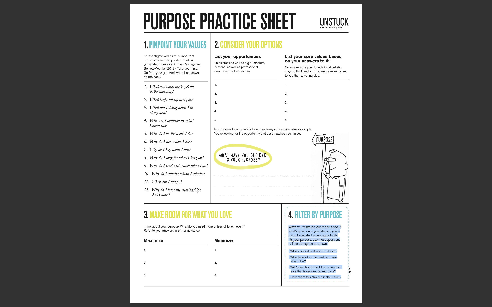

# PURPOSE PRACTICE SHEET

## PINPOINT YOUR VALUES

To investigate what’s truly important to you, answer the questions below (expanded from a set in Life Reimagined, Berrett-Koehler, 2013). Take your time. Go from your gut. And write them down on the back.

1. What motivates me to get up in the morning?
    - The idea that I’m working on or towards something meaningful
2. What keeps me up at night?
    - The violence that is done to others.
3. What am I doing when I’m at my best?
    - Exploring, freely and without pressure
4. Why am I bothered by what bothers me?
    - Because injustice is unacceptable
5. Why do I do the work I do?
    - Because technology has the potential, and it has shown itself, as a mechanism to change the world.
6. Why do I live where I live?
    - Because I love being outdoors, playing on the beach and being in an environment that makes me feel at peace.
7. Why do I buy what I buy?
    - Because I am connected to what I buy. As we learned in the video, my limbic system is feeling out what it desires.
8. Why do I long for what I long for?
    - Becuase it means a better life for me and potentially for others
9. Why do I read and watch what I do?
    - Because it inspires me, wiskes me away ito a world of imagination, or is just purely entertaining.
10. Why do I admire whom I admire?
    - Because they do things that inspire me to be a better person or show me something that I never believed possible.
11. When am I happy?
    - When I feel connected to others. When I succeed. When I experience something new and delightful. When I re-experience something that I love.
12. Why do I have the relationships that I have?
    - Because they support me and they heighten the experience that I have on this planet.

---

## CONSIDER YOUR OPTIONS

### List your opportunities

Think small as well as big or medium, personal as well as professional, dreams as well as realities.

1. Moving to a new home that my family feels comfortable in. `(connected to values #1, 2, 3, 5)`
1. Starting my first full time job as a software engineer. `(connected to values #2, 3, 5)`
1. Getting a green card for my wife, the appointment was finally just booked! `(connected to values #2, 3, 5)`
1. Being fully vaccinated from Covid-19. `(connected to values #1, 2, 4, 5)`
1. Making enough money for my family to eat two + meals out per day. `(connected to values #1, 2, 3, 4)`

### List your core values based on your answers to the last prompt ^

Core values are your foundational beliefs, ways to think and act that are more important to you than anything else.

1. Non-violence (physical and emotional)
1. Community
1. Joyful living
1. Truth and Integrity
1. Family

### WHAT HAVE YOU DECIDED IS YOUR PURPOSE?

- To live a life in community with people who live with integrity that are commited to spreading the seeds of non-violent actions that work towards joyful lives for all living beings with bodies.

---

## MAKE ROOM FOR WHAT YOU LOVE

Think about your purpose. What do you need more or less of to achieve it?
Refer to your answers in #1 for guidance.

### Maximize

1. Meaningful connections with other humans committed to the same mission.
1. Supporting business that prioritize vegan, sustainable and equitable practices
1. Compassion for those who do not yet share this perspective.

### Minimize

1. Fear and Anxiety
1. Proximity to toxic beings
1. Self-doubt

---

## FILTER BY PURPOSE

When you’re feeling out of sorts about what’s going on in your life, or if you’re trying to decide if a new opportunity fits your purpose, use these questions to filter through to an answer.

- What core value does this fit with?
- What level of excitement do I have about this?
- Will/does this distract from something else that is very important to me?
- How might this play out in the future?

---

Taken from:

